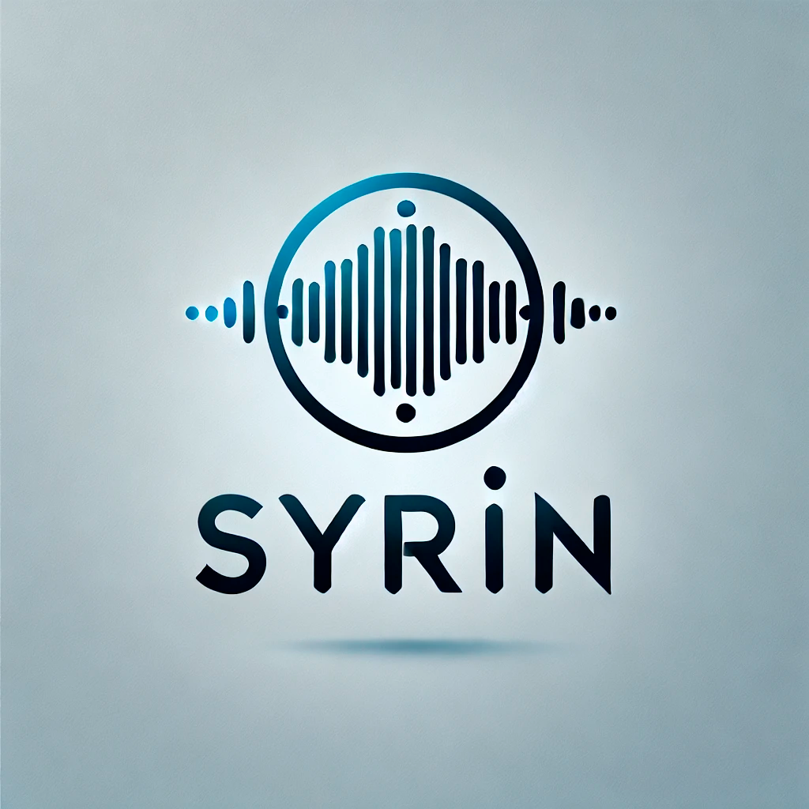

<div align="center">
  
</div>

# Guia de Instalação do SYRIN

SYRIN é uma solução inovadora projetada para melhorar o monitoramento de infraestrutura de TI, proporcionando humanização em alertas críticos, aumentando a conscientização e o engajamento na resposta a incidentes. Este guia oferece o passo a passo para instalar e configurar os componentes do SYRIN em um ambiente Kubernetes.

## Pré-requisitos

- **Cluster Kubernetes**: Certifique-se de ter um cluster Kubernetes funcional.
- **kubectl**: Ferramenta de linha de comando para controlar clusters Kubernetes.
- **Configuração de Namespace**: Um namespace designado para os componentes do SYRIN.

## Passos para a Instalação

Siga estes passos para implantar o SYRIN e seus componentes:

### Passo 1: Configurar o Namespace

Crie o namespace para organizar os componentes do SYRIN:

```bash
kubectl apply -f ./k8s/namespace.yaml
```

### Passo 2: Instalar Componentes Base

SYRIN depende de alguns serviços base para gerenciar mensagens, armazenamento e processamento de linguagem. Instale esses componentes na ordem especificada:

#### 1. RabbitMQ

RabbitMQ é o broker de mensagens utilizado pelo SYRIN para enfileirar e rotear mensagens entre serviços.

```bash
kubectl apply -f ./k8s/01-base/01-rabbitmq/
```

#### 2. MinIO

MinIO fornece o armazenamento para os arquivos de áudio do SYRIN. É onde os arquivos de áudio gerados serão armazenados, recuperados e gerenciados.

```bash
kubectl apply -f ./k8s/01-base/02-minio/
```

#### 3. Ollama

Ollama é o modelo de linguagem AI usado pelo SYRIN para humanização de texto e processamento de linguagem.

```bash
kubectl apply -f ./k8s/01-base/03-ollama/
```

### Passo 3: Implantar os Componentes SYRIN

Com os componentes base configurados, prossiga com a instalação de cada componente do SYRIN:

#### 1. syrin-webhook

Este componente gerencia as notificações recebidas via webhook e as processa no sistema SYRIN.

```bash
kubectl apply -f ./k8s/02-syrin-webhook/
```

#### 2. syrin-bridge

O componente bridge é responsável pelo roteamento de mensagens dentro do SYRIN, conectando vários serviços e garantindo o fluxo eficiente das mensagens.

```bash
kubectl apply -f ./k8s/03-syrin-bridge/
```

#### 3. syrin-humanization

O componente de Humanização do SYRIN aplica processamento com IA para transformar mensagens do sistema em alertas humanizados e envolventes.

```bash
kubectl apply -f ./k8s/04-syrin-humanization/
```

#### 4. syrin-make-audio-tts

Este componente gera áudio a partir de mensagens de texto, permitindo notificações auditivas para alertas.

```bash
kubectl apply -f ./k8s/05-syrin-make-audio-tts/
```

#### 5. syrin-notify-message

O componente de notificação de mensagens gerencia o envio de notificações para os endpoints configurados.

```bash
kubectl apply -f ./k8s/06-syrin-notify-message/
```

### Informações Adicionais

Para configurar o componente **Syrin Speak**, que reproduz o áudio gerado, consulte o [Repositório SYRIN Speak](https://github.com/syrin-alert/syrin-install). Esse repositório inclui instruções detalhadas de instalação e configuração do serviço.

## Conclusão

Após concluir esses passos, sua configuração do SYRIN estará totalmente operacional em seu ambiente Kubernetes, fornecendo notificações de alertas humanizados em tempo real para melhorar o monitoramento da infraestrutura de TI.

## Licença

Este projeto está licenciado sob a Licença MIT.
